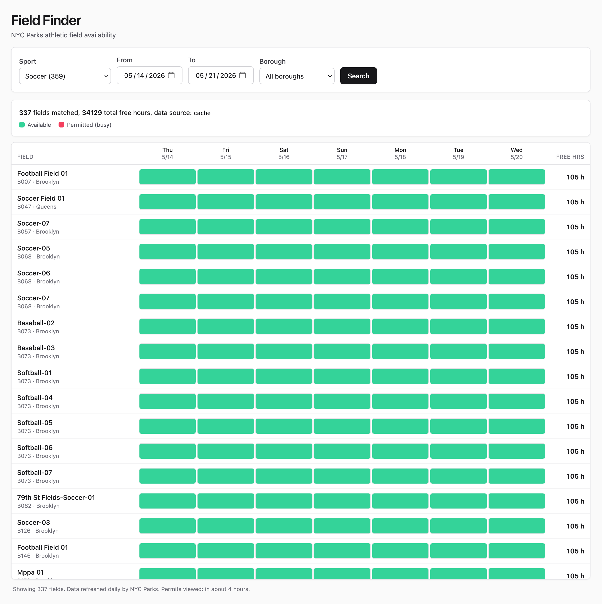
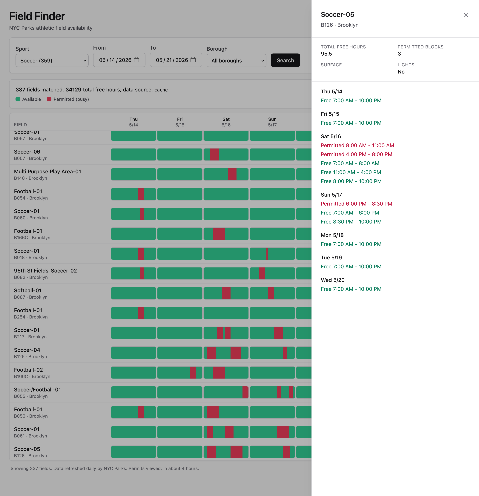
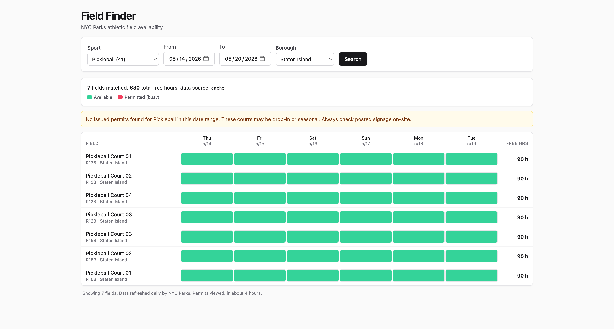

# Field Finder

NYC Parks athletic field availability across many fields and a date range, on a single screen.

**Live demo:** https://mflat-field-finder.onrender.com
*(Free-tier instance; first request after idle may take ~30s to wake.)*

The official NYC Parks permit map is pin-by-pin and date-by-date. A youth sports coordinator scheduling a season needs to compare many fields across a date range at once. This tool does that.

## How to use it

Visit the live URL. Pick a sport, pick dates, optionally pick a borough, hit Search.

### The main view

Filter by sport, date range, and optionally borough. Every matching field shows up sorted by total free hours, with a color-coded grid showing free vs. permitted time per day. Green is open, red is permitted. The example below shows Soccer fields in Staten Island for a six-day range.



### Drill into any field

Click any row for a day-by-day breakdown: who has the field, when, and what's left. The example shows Softball-02 in Brooklyn with three permitted blocks across the week and the exact free windows around them.



### Domain insight, not just data

A search for pickleball returned facilities with no permits at all, which initially looked like a bug. It isn't. NYC Parks runs pickleball as drop-in, first-come-first-served on shared courts rather than via exclusive-use permits. The tool detects low-permit-density sports and surfaces an explanation, rather than silently returning a misleading all-green grid that would tell a coordinator every court is bookable.



## Architecture

- React + Vite + TypeScript + Tailwind frontend with a custom field-by-day availability matrix.
- FastAPI backend with two HTTP clients (Socrata facility catalog + per-park permit CSV) and an interval-inversion algorithm that turns busy permits into free windows.
- SQLite TTL cache, with a background prefetch of popular-sport permits at startup so the first user query is warm.

Full system diagram: [docs/architecture.md](docs/architecture.md).
Data sources and how they were discovered: [docs/data-sources.md](docs/data-sources.md).

## How AI was used

This project was built end-to-end through Claude Code, structured as a 10-phase plan in [PLAN.md](PLAN.md). The commit history mirrors those phases one-for-one. A persistent [CLAUDE.md](CLAUDE.md) carried conventions, the stack, and working agreements across sessions so each phase started with the same context.

The human role was architecture, direction, review, and judgment. At each phase: specifying the contract precisely, reading every diff, catching bugs, and deciding tradeoffs. A few concrete examples that the model would not have arrived at unprompted:

- **Data source choice.** Rather than scraping the Leaflet map with a headless browser, identifying the underlying per-park CSV endpoint and using it directly. The model would have implemented either; the decision and rationale were mine.
- **UI choice.** Rejecting FullCalendar's resource-timeline view (premium plugin, poor fit for "compare 300+ fields") in favor of a custom field-by-day matrix. Lighter, more scannable, and free.
- **Performance call.** When basketball queries first felt slow, deciding on background catalog warm-up plus permit prefetch for popular sports at startup, rather than a heavier caching layer.
- **Domain insight feature.** Looking at a pickleball query that came back empty and recognizing this as a real-world signal worth surfacing, not a bug to hide. That observation became the permit-density banner.
- **WAF workaround with honesty.** The permit endpoint sits behind CloudFront and rejects plain bot User-Agents. We use a hybrid Mozilla-prefixed UA with our app name appended, and document the tradeoff candidly in [docs/data-sources.md](docs/data-sources.md) including the note that a production deployment should request an allow-list from NYC Parks instead.
- **Bug review.** Catching that the `CLOSED` badge was firing on fields with 105 free hours, because `has_full_closure` was true if any closure permit existed for that field, regardless of whether it overlapped the queried week. Fixed in [adf5ff7](https://github.com/JasinMarku/mflat-field-finder/commit/adf5ff7) and [5d36a6a](https://github.com/JasinMarku/mflat-field-finder/commit/5d36a6a).
- **Threshold tuning.** The permit-density signal initially flagged Soccer as "low density," which was wrong: Soccer is the highest-permit-density sport in NYC. The original logic measured the percentage of facilities with any permit, which failed because permits cluster in a small number of high-traffic parks. I changed it to use total permitted slot count instead of facility ratio, which correctly distinguishes "drop-in sports" (pickleball, 0-5 slots citywide) from "permit-heavy sports" (soccer, hundreds of slots). Tuned by comparing live results across sports, not by picking a number that felt right.

## Engineering tradeoffs

| Decision | Rationale |
| --- | --- |
| Per-park CSV endpoint instead of headless browser | Faster, more reliable, politer than scraping the Leaflet map. |
| SQLite cache instead of Redis | Zero-ops, single file, easy to inspect; swappable later. |
| Custom matrix instead of FullCalendar | Lighter, free, better fit for "many fields at once" than a Gantt-style timeline. |
| Top 100 rows + Load more | Avoids virtualization library while keeping initial render fast on 390-row queries. |
| Background prefetch on startup | First user query hits cache without paying the cold-fetch cost in the request path. |
| Hybrid User-Agent | The only way past CloudFront's WAF; tradeoff documented openly. |
| Default operating hours 7am to 10pm | Real hours vary per facility; close enough for a demo and configurable later. |

## What would change for production

- Move the cache to Redis so multiple workers share state.
- Attach a persistent disk so the SQLite cache survives cold starts.
- A scheduled refresher (apscheduler) that re-warms popular sports nightly.
- Structured logs, OpenTelemetry traces, per-park latency metrics.
- Partner with NYC Parks for an allow-listed egress IP or a real API key, so we are not depending on a hybrid User-Agent.

Features deferred to stay inside the brief's one-hour spirit:

- **Mobile-first view.** The current matrix is built for a desktop or laptop screen where you're comparing many fields side by side. On a phone, that comparison fundamentally fights a 390-pixel viewport. For mobile I would not make the matrix responsive: I would build a different view entirely, a sorted list of top-10 fields with compact per-day chips instead of a grid. A coordinator on a phone is usually answering "where can my team play tonight," which is a different shape of question than "compare my full schedule for the week."
- Shareable query URLs
- CSV export of matching slots
- Map view alongside the matrix
- Per-sport operating hours

The constraint was the point.

## For reviewers: running locally

The live demo above is the same code as this branch. The instructions below are only if you want to run it yourself.

### Docker (one command)

```sh
docker build -t fieldfinder .
docker run -p 8000:8000 fieldfinder
# open http://localhost:8000
```

### Local dev servers (two terminals)

Backend:

```sh
cd apps/api
python -m venv .venv && source .venv/bin/activate
pip install -e ".[dev]"
python -m app.cli serve --reload
```

Frontend:

```sh
cd apps/web
npm install
npm run dev
# open http://localhost:5173
```

The Vite dev server proxies `/api` to `http://localhost:8000`.

### Run the tests

```sh
cd apps/api && source .venv/bin/activate && pytest -q   # 48 tests
cd ../web && npx tsc --noEmit                            # type check
```

### CLI

A Typer CLI was built before the HTTP API so the data layer could be verified independently.

```sh
python -m app.cli sports
python -m app.cli catalog --sport soccer --limit 10
python -m app.cli permits M028
python -m app.cli check soccer 2026-05-18 2026-05-25 --park-id M028
```

## Repository layout

```
apps/
  api/                 FastAPI + Pydantic + httpx + Typer CLI
    app/
      cache.py         SQLite TTL cache
      clients/         socrata.py, permits.py
      domain/          availability.py (interval inversion), sports.py
      routes/          sports, facilities, availability
      main.py          FastAPI app, lifespan warms catalog + prefetches
      cli.py           Typer commands for ops and verification
    tests/             48 tests
  web/                 React + Vite + TS + Tailwind
    src/
      components/      QueryBar, AvailabilityMatrix, FieldRow, FacilityDrawer
      lib/             api.ts, matrix.ts, labels.ts
docs/                  architecture.md, data-sources.md, images/
Dockerfile             multi-stage build, serves frontend from FastAPI
render.yaml            Render blueprint
PLAN.md                10-phase plan; commits map 1:1
CLAUDE.md              persistent conventions and context
```

## License

MIT
